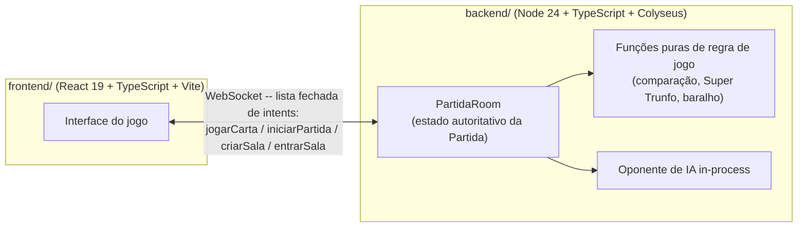
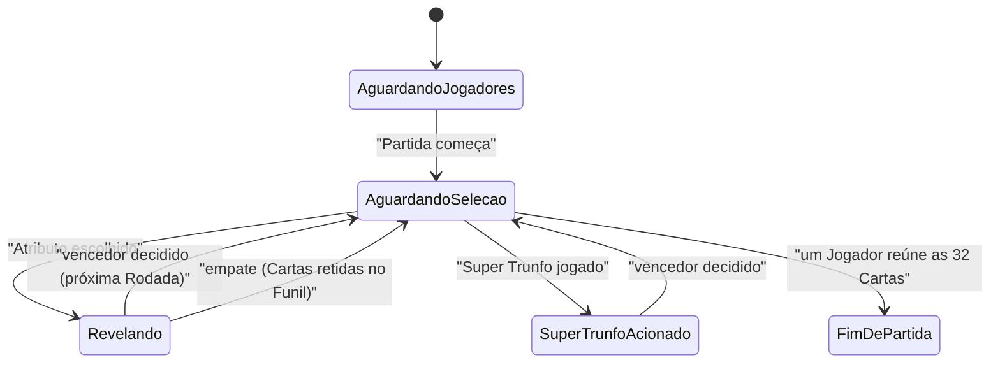
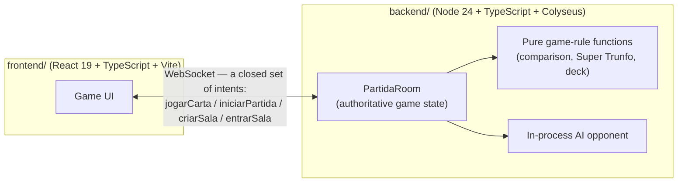
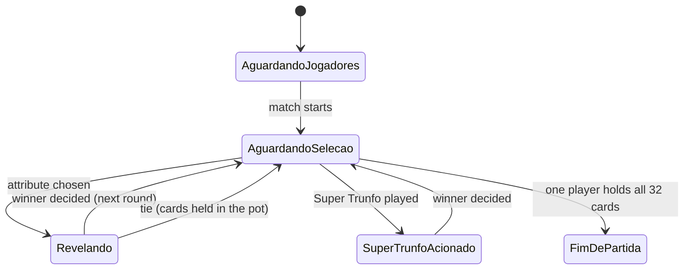

# 🏎️ Super Trunfo Web

**Uma versão multiplayer em tempo real do clássico jogo de cartas brasileiro — com servidor de jogo autoritativo, regras 100% automatizadas, e uma IA que assume o lugar de quem cai no meio da Partida.**

🎮 **[Jogue agora](https://supertrunfoweb.onrender.com/)** — sem instalar nada, crie uma sala e compartilhe o link com os amigos.

> A demo roda no plano gratuito do Render, então o servidor pode levar alguns segundos pra "acordar" na primeira requisição.

<a id="portugues"></a>
🌐 Você está lendo a versão em 🇧🇷 **português**. → [🇺🇸 Read this in English](#english)

<!-- TODO(Mauricio): trocar por um screenshot real em docs/screenshots/mesa-de-jogo.png -->


## Sumário

- [O que é o Super Trunfo](#o-que-é-o-super-trunfo)
- [Principais Funcionalidades](#principais-funcionalidades)
- [Arquitetura](#arquitetura)
- [Stack Técnica](#stack-técnica)
- [Rodando Localmente](#rodando-localmente)
- [Rodando os Testes](#rodando-os-testes)
- [Estrutura do Projeto](#estrutura-do-projeto)
- [🇺🇸 English version](#english)

## O que é o Super Trunfo

O Super Trunfo é o clássico jogo de cartas de comparação, tradicional no Brasil. Este projeto automatiza o jogo físico de ponta a ponta e o torna jogável online, em tempo real, entre dispositivos diferentes.

<!-- TODO(Mauricio): trocar por um screenshot real em docs/screenshots/carta.png se quiser substituir esta imagem de referência -->


O Baralho tem 32 Cartas, organizadas em 8 Grupos de 4 Cartas cada. Toda Carta traz o mesmo conjunto de Atributos numéricos de um carro (velocidade máxima, potência, aceleração, etc.). Cada Rodada funciona assim:

1. O Jogador da vez escolhe um Atributo da própria Carta do topo.
2. A Carta do topo de todos os outros Jogadores revela o mesmo Atributo, simultaneamente.
3. Quem tiver o maior valor vence a Rodada e coleta todas as Cartas jogadas — exceto num Atributo (Aceleração 0-100 km/h), no qual **o menor** valor vence.
4. O vencedor escolhe o Atributo da próxima Rodada.
5. Uma Carta do Baralho é o **Super Trunfo** (coringa): jogá-la vence a Rodada automaticamente — a menos que um oponente tenha uma Carta terminada na letra "A", que vence no lugar dela.
6. Um empate manda todas as Cartas daquela Rodada pro Funil; elas ficam retidas até a próxima Rodada resolver, indo pro vencedor dela.
7. Um Jogador é eliminado quando o Monte dele chega a zero. A Partida acaba quando um único Jogador reúne as 32 Cartas.

## Principais Funcionalidades

- 🔗 **Salas por link de convite** — crie uma sala, compartilhe um único link, os amigos entram na hora. Sem conta, sem fila de matchmaking.
- 🤖 **Preenchimento e substituição por IA** — vagas vazias já começam jogadas por IA; se um Jogador cai no meio da Partida, uma IA assume o Monte dele exatamente de onde parou, sem travar o jogo.
- 🔄 **Tolerância a reconexão** — uma queda breve de conexão na Sala de Espera ganha uma janela curta de tolerância antes do assento ser liberado, em vez de destruir a sala na hora.
- 🃏 **Regras 100% automatizadas** — a Carta Super Trunfo (com sua regra de exceção pela Carta letra "A"), o Funil de desempate, a eliminação e a vitória por reunir as 32 Cartas são todos aplicados pelo servidor.
- 📱 **Responsivo** — layout mobile-first que escala pra uma Mesa em tela cheia no desktop.
- 📖 **FAQ de regras dentro do próprio app** — não precisa já saber jogar pra entrar numa sala.

## Arquitetura

Dois pacotes independentes que só se comunicam via WebSocket — sem código compartilhado, sem import entre um e outro:



- **Servidor autoritativo.** O frontend nunca decide uma regra de jogo — só envia intents de uma lista fechada. Toda regra (vencedor, eliminação, desempate) é decidida no `backend/`.
- **Estado filtrado, não só interface filtrada.** A conexão WebSocket de cada cliente só recebe a própria Carta do topo por inteiro; o Monte dos oponentes só aparece como contagem de Cartas. Essa filtragem acontece no servidor, então ninguém consegue inspecionar o Monte de um oponente pelo devtools do navegador.
- **O game loop é uma máquina de estados explícita** — nenhuma fase do jogo é rastreada como uma combinação implícita de booleanos:



  Uma Rodada empatada resolve direto de volta pra seleção de Atributo, no mesmo ciclo do servidor — nunca existe um estado de rede intermediário pra "empate pendente", já que nada num empate precisa de uma ida-e-volta com o cliente pra resolver.

- **O oponente de IA roda in-process** — sem serviço separado, sem chamada de rede. Uma desconexão no meio da Partida entrega o assento pra mesma função de decisão síncrona que um assento já preenchido por IA usa desde o início.

## Stack Técnica

**Backend** (`backend/`)

- Node.js 24, TypeScript
- [Colyseus](https://colyseus.io/) 0.17 — framework de servidor de jogo multiplayer autoritativo
- Express (health check / passthrough estático)

**Frontend** (`frontend/`)

- React 19, TypeScript
- Vite 8
- Cliente `@colyseus/sdk`

**Testes** — uma pirâmide de 4 camadas, priorizando as camadas que realmente pegam bug de regra:

1. **Unitário** (Vitest) — funções puras de regra de jogo em `backend/src/game/`
2. **Integração de Room** (`@colyseus/testing`) — cenários completos de multiplayer contra uma Room real do Colyseus
3. **Componente** (Vitest + React Testing Library) — telas do frontend isoladas
4. **Ponta a ponta** (Playwright) — frontend real contra backend real, do ponto de vista do navegador

## Rodando Localmente

Requer Node.js 24.

Este repositório tem três `package.json` independentes (raiz, `backend/`, `frontend/`) em vez de um npm workspace — instale cada um separadamente:

```bash
npm install              # raiz (testes E2E)
cd backend && npm install
cd ../frontend && npm install
```

Rode o backend e o frontend em dois terminais separados:

```bash
cd backend && npm run dev   # servidor Colyseus
cd frontend && npm run dev  # servidor de dev do Vite
```

## Rodando os Testes

```bash
npm test
```

Roda as 4 camadas da pirâmide de testes em sequência: unitário do backend → integração de Room do backend → componente do frontend → ponta a ponta.

## Estrutura do Projeto

```text
SuperTrunfoWeb/
├── backend/     # Servidor de jogo Colyseus (Node + TypeScript)
├── frontend/    # Cliente React (Vite + TypeScript)
├── e2e/         # Testes ponta a ponta Playwright (frontend + backend reais)
└── docs/        # Dados do jogo (CSV dos carros) e referências de design
```

<sub>Uma nota sobre o `overrides` em `backend/package.json`: ele redireciona `@colyseus/uwebsockets-transport` pra `@colyseus/ws-transport` -- um workaround porque o ambiente de dev não consegue instalar o pacote original (que depende de um fetch via git). Não tem efeito funcional nenhum, já que o app usa `WebSocketTransport` diretamente.</sub>

---

<a id="english"></a>

## 🇺🇸 English

🌐 You are reading the English version. → [🇧🇷 Ler em português](#portugues)

### Table of Contents

- [What is Super Trunfo?](#what-is-super-trunfo)
- [Key Features](#key-features)
- [Architecture](#architecture)
- [Tech Stack](#tech-stack)
- [Getting Started](#getting-started)
- [Running the Tests](#running-the-tests)
- [Project Structure](#project-structure)

### What is Super Trunfo?

Super Trunfo is the Brazilian name for the card-comparison game known internationally as **Top Trumps**. This project automates the physical card game end-to-end and makes it playable online, in real time, across separate devices.


The deck has 32 cards, grouped into 8 categories of 4 cards each. Every card lists the same set of numeric attributes for a car (top speed, horsepower, acceleration, and so on). Each round works like this:

1. The active player picks one attribute from their own top card.
2. Every other player's top card reveals that same attribute, simultaneously.
3. Whoever has the highest value wins the round and collects every card that was played — except for one attribute (0-100 km/h acceleration) where **lower** wins.
4. The winner picks the attribute for the next round.
5. One card in the deck is the **Super Trunfo** (wildcard): playing it wins the round automatically — unless an opponent holds a card ending in the letter "A", which beats it instead.
6. A tie sends every card played that round into a holding pot; it carries over and goes to whoever wins the next round.
7. A player is eliminated when their deck runs out. The game ends when one player holds all 32 cards.

### Key Features

- 🔗 **Invite-link rooms** — create a room, share one link, friends join instantly. No accounts, no matchmaking queue.
- 🤖 **AI fill-in & disconnect takeover** — empty seats are played by AI from the start; if a player disconnects mid-match, an AI takes over their hand exactly where they left off, so the game never stalls.
- 🔄 **Reconnection tolerance** — a brief connection drop in the waiting room gets a short grace window before the seat is given up, instead of destroying the room instantly.
- 🃏 **Fully automated ruleset** — the Super Trunfo wildcard (with its Card-A counter-rule), the tie-breaker pot, elimination, and win-by-collecting-all-32-cards are all enforced server-side.
- 📱 **Responsive** — a mobile-first layout that scales up to a full-screen desktop table.
- 📖 **In-app rules FAQ** — no need to already know the game to join a room.

### Architecture

Two independent packages that only ever talk to each other over WebSocket — no shared code, no imports across the boundary:



- **Server-authoritative.** The frontend never decides a game rule — it only sends intents from a closed list. Every rule (winner, elimination, tie handling) is decided in `backend/`.
- **Filtered state, not just a filtered UI.** Each client's WebSocket connection only ever receives its own hand's top card in full; opponents' decks are exposed only as a card count. That filtering happens server-side, so nobody can inspect an opponent's hand through the browser's devtools.
- **The round loop is an explicit state machine** — no game phase is tracked as an implicit combination of booleans or flags:



  A tied round resolves straight back to card selection in the same server tick — there's never an intermediate network state for "tie pending," since nothing about a tie needs a client round-trip to resolve.

- **The AI opponent runs in-process** — no separate service, no network hop. A disconnect mid-match hands the seat to the same synchronous decision function a bot-filled seat already uses.

### Tech Stack

**Backend** (`backend/`)

- Node.js 24, TypeScript
- [Colyseus](https://colyseus.io/) 0.17 — authoritative multiplayer game server framework
- Express (health checks / static passthrough)

**Frontend** (`frontend/`)

- React 19, TypeScript
- Vite 8
- `@colyseus/sdk` client

**Testing** — a 4-layer pyramid, weighted toward the layers that actually catch a rules bug:

1. **Unit** (Vitest) — pure game-rule functions in `backend/src/game/`
2. **Room integration** (`@colyseus/testing`) — full multiplayer scenarios against a real Colyseus room
3. **Component** (Vitest + React Testing Library) — frontend screens in isolation
4. **End-to-end** (Playwright) — a real frontend against a real backend, from the browser's point of view

### Getting Started

Requires Node.js 24.

This repo has three independent `package.json` files (root, `backend/`, `frontend/`) instead of an npm workspace — install each one separately:

```bash
npm install              # root (E2E tests)
cd backend && npm install
cd ../frontend && npm install
```

Run the backend and the frontend in two separate terminals:

```bash
cd backend && npm run dev   # Colyseus game server
cd frontend && npm run dev  # Vite dev server
```

### Running the Tests

```bash
npm test
```

Runs all four test-pyramid layers in sequence: backend unit → backend Room integration → frontend component → end-to-end.

### Project Structure

```text
SuperTrunfoWeb/
├── backend/     # Colyseus game server (Node + TypeScript)
├── frontend/    # React client (Vite + TypeScript)
├── e2e/         # Playwright end-to-end tests (real frontend + real backend)
└── docs/        # Game data (car specs CSV) and design references
```

<sub>A note on `overrides` in `backend/package.json`: it redirects `@colyseus/uwebsockets-transport` to `@colyseus/ws-transport` — a workaround for a dev environment that can't install the original package (it depends on a git-based fetch). It has no functional effect, since the app already uses `WebSocketTransport` directly.</sub>
