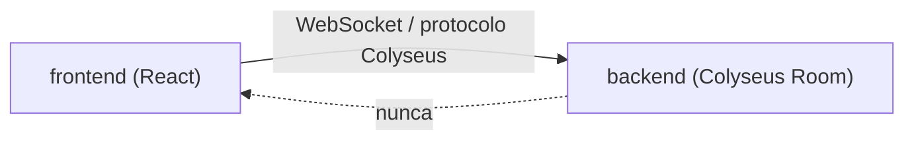
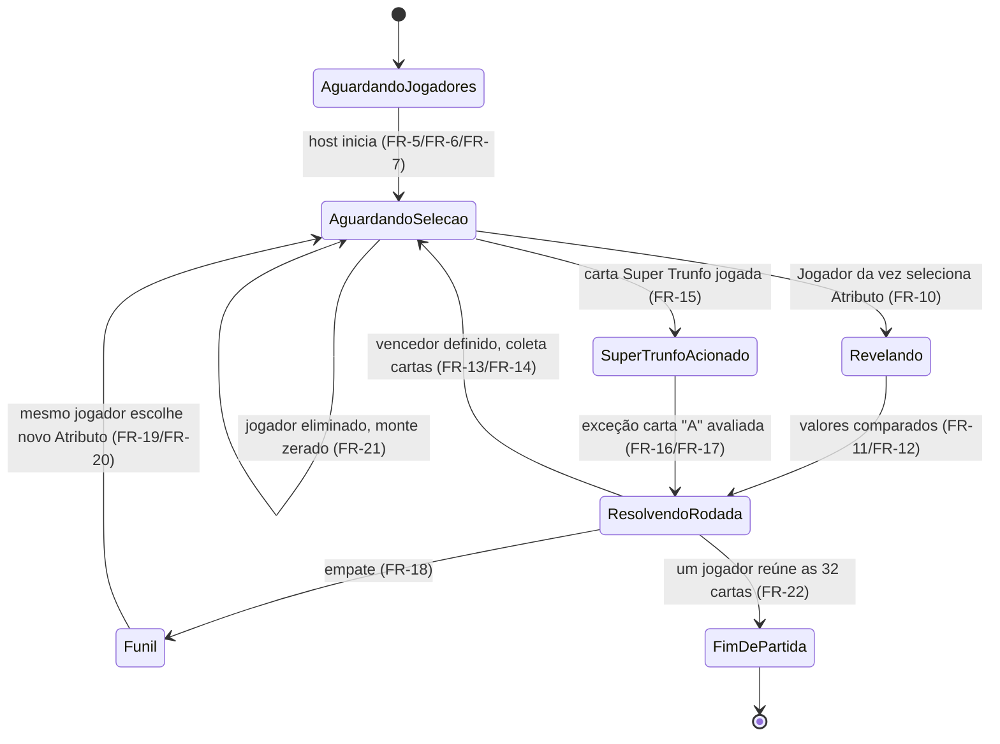

# Architecture Spine — Super Trunfo Web

## Design Paradigm

**Servidor Autoritativo com Sincronização de Estado.** O estado canônico de cada Partida vive inteiramente no servidor (um Colyseus `Room`); o cliente é uma camada de apresentação e captura de intenção — nunca decide uma regra do jogo, nunca é fonte de verdade. Todo o comportamento descrito no PRD (game loop, Super Trunfo, Funil, eliminação) é lógica de servidor.

Mapeamento de camadas:
- `backend/src/rooms/` — Room = dono do estado + máquina de estados do game loop (a "camada de domínio").
- `backend/src/game/` — regras puras do jogo (comparação de Atributos, resolução de Rodada, condições de fim), testáveis sem rede.
- `frontend/src/` — renderização do estado recebido + captura de intenção do Jogador (clique em Atributo, criar/entrar em Sala); zero lógica de regra.

## Invariants & Rules



### AD-1 — Estado canônico só existe no servidor

- **Binds:** todos os FRs de game loop (FR-9 a FR-22), FR-5, FR-23
- **Prevents:** lógica de regra duplicada ou divergente entre cliente e servidor (ex: cliente calculando quem venceu a Rodada "pra ficar mais rápido" e discordando do servidor); e dois implementadores inventando contratos de mensagem incompatíveis por falta de uma lista fechada
- **Rule:** o cliente só envia os *intents* abaixo — **lista fechada, não exaustiva por exemplo**; qualquer intent novo precisa de uma entrada aqui antes de existir em código. O servidor aplica a regra, muta o estado e transmite o novo estado. Nenhuma decisão de jogo (vencedor, eliminação, fim de Partida) é tomada no `frontend/`.

  | Intent (cliente → servidor) | Payload | Estados que aceitam | Efeito |
  | --- | --- | --- | --- |
  | `jogarCarta` | `{ atributo?: string }` | `AguardandoSelecao` (só do Jogador da vez) | Joga a Carta do topo do Monte do Jogador da vez. Se a Carta **não** tem a flag Super Trunfo, `atributo` é obrigatório → transição pra `Revelando` (FR-10). Se **tem** a flag, `atributo` é ignorado (pode vir vazio) e o servidor aplica FR-15/16/17 direto → transição pra `ResolvendoRodada`. Um único intent cobre os dois casos porque, do ponto de vista do Jogador, a ação é sempre "jogar a carta do topo" — quem decide o que ela desencadeia é o servidor, olhando a flag (coerente com AD-1: cliente nunca decide regra). |
  | `iniciarPartida` | `{}` | `AguardandoJogadores` (só do host) | Fecha a Sala de Espera, roda FR-6/FR-7 (embaralhar/distribuir), define o Jogador Inicial (ver AD-5) → transição pra `AguardandoSelecao`. |
  | `criarSala` / `entrarSala` | `{ nome: string }` / `{ nome: string, roomId: string }` | fora de uma Room (matchmaking) | Ver AD-2. |

### AD-2 — Uma Room = o ciclo de vida inteiro de uma Partida

- **Binds:** Arquitetura de Informação da UX (Criar Sala → Sala de Espera → Mesa de Jogo → Fim de Partida)
- **Prevents:** um segundo tipo de Room para a fase de jogo, exigindo handoff de estado entre Rooms e duplicando a lista de Jogadores
- **Rule:** um único tipo de Room (`PartidaRoom`) cobre da Sala de Espera ao Fim de Partida, com uma máquina de estados interna — ver AD-5. Criar Sala = criar uma instância de `PartidaRoom` (gera um `roomId`, base do link de convite). Entrar na Sala = `joinById(roomId)` a partir do link recebido — **nunca** `joinOrCreate`/matchmaking genérico, que poderia colocar um desconhecido na Sala de outra pessoa (contradiria a Não-Meta do PRD "sem matchmaking com desconhecidos").

### AD-3 — Visibilidade de Carta filtrada no servidor, nunca só na UI

- **Binds:** RNF-3 (anti-cheat), FR-8, FR-11
- **Prevents:** enviar o Monte completo de todos os Jogadores pra todos os clientes e confiar só na interface pra esconder as demais Cartas (falha real — quase repetida durante a fase de UX); e uma predicate de filtro com bug corromper o estado que a própria lógica de jogo/IA enxerga
- **Rule:**
  - **Duas representações, nunca uma.** Existe um `EstadoPartida` canônico **não filtrado**, usado por toda a lógica em `backend/src/game/` e por `decidirAtributoIA` (AD-4) — e uma **view filtrada por cliente**, aplicada só na borda de serialização de rede (Colyseus `StateView`/schema filtering). Nenhuma função de regra ou de IA lê a view filtrada; elas só existem no canônico.
  - **O que cada estado revela, por cliente:** fora de `Revelando`/`ResolvendoRodada`/`Funil`, um cliente só vê a **contagem** de Cartas do Monte de cada oponente — nunca conteúdo. Ao entrar em `Revelando`, a **Carta do topo inteira** (todos os Atributos, Grupo/Letra, flag Super Trunfo) de cada Jogador ativo fica visível pra **todos** os clientes — não só o valor do Atributo selecionado (resolve a leitura conflitante entre FR-11 "revela o valor do atributo" e o `EXPERIENCE.md` "todas as cartas viram": a revelação de rede é sempre a Carta completa; FR-11 descreve o que o Jogador *usa* pra decidir o vencedor, não o tamanho do payload).

### AD-4 — IA roda in-process, dentro da Room, aplicada atomicamente

- **Binds:** FR-5, FR-23
- **Prevents:** IA implementada como um client de rede separado (round-trip desnecessário, risco de latência, superfície de bug maior); e uma pausa "de encenação" (esperar antes da IA jogar, pra dar ritmo visual) reabrir a janela de mensagens concorrentes que AD-5 existe pra fechar (duas jogadas na mesma Rodada, handoff de reconexão no meio de uma decisão)
- **Rule:** quando o Jogador da vez é IA, a própria máquina de estados da Room chama `decidirAtributoIA(estado, jogadorId)` — síncrona, in-process, nunca um socket adicional — e **aplica o resultado atomicamente dentro da mesma transição que entra em `AguardandoSelecao`**, antes de qualquer outra mensagem ser processada pela Room. Se o ritmo visual (animação de "pensando") for desejado, o atraso é **só do lado do cliente** (o servidor já decidiu e já mudou de estado; o cliente atrasa a exibição) — nunca um `setTimeout`/delay no servidor entre a entrada no estado e a aplicação da decisão.

### AD-5 — Game loop é uma máquina de estados explícita

- **Binds:** FR-9 a FR-22 (dinâmica de rodada, Super Trunfo, Funil, fim de jogo), RNF-1 (teto de 1,5s de processamento por transição)
- **Prevents:** lógica de Rodada como uma sequência de `if`s implícitos sem um modelo de estado único — risco real de estado inconsistente (ex: dois Jogadores conseguindo selecionar Atributo na mesma Rodada); e trabalho pesado/bloqueante dentro de uma transição, violando RNF-1
- **Rule:** estados nomeados e transições explícitas, conforme abaixo. Toda transição passa por `backend/src/game/`, e cada transição (seleção → revelação → resolução) é síncrona e local — sem I/O externo, sem chamada de rede — precisamente pra manter a margem do teto de 1,5s do RNF-1 sem esforço extra.

  **`AguardandoSelecao` tem três entradas com semânticas de turno diferentes — tratar como três ações de entrada distintas, nunca um `onEnter` genérico compartilhado:**
  1. Vindo de `ResolvendoRodada` sem empate: `jogadorDaVez` **muda** pro vencedor da Rodada (FR-14).
  2. Vindo de `Funil`: `jogadorDaVez` **não muda** — permanece o Jogador que abriu a Rodada empatada (FR-19).
  3. Self-loop de eliminação: `jogadorDaVez` não muda, exceto pra pular um Jogador que acabou de ser eliminado na ordem de turno (FR-21).

  **Jogador Inicial (FR-9):** `[ASSUMPTION]` o host é sempre o Jogador Inicial da primeira Rodada de cada Partida — regra simples, sem sorteio. Não confirmado com o usuário.



  **Forma do schema (`Rodada`/`Funil` são identificadores do Glossário — precisam existir como campos nomeados, não só como conceito de prosa):** `EstadoPartida.rodadaAtual` é um objeto `{ jogadorDaVez, atributoSelecionado?, cartasEmDisputa: Carta[] }`; `EstadoPartida.funil` é `{ cartasPresas: Carta[] }`, populado só durante o estado `Funil` e esvaziado na coleta (FR-20). Ambos nested em `EstadoPartida`, não classes Schema de topo separadas — ver Structural Seed.

### AD-6 — Regra de sobra na distribuição (resolve PRD §8.3, FR-7)

- **Binds:** FR-7
- **Prevents:** duas implementações divergentes da regra de sobra (uma descartando, outra redistribuindo)
- **Rule:** `[ADOPTED nesta arquitetura]` Fórmula geral: `cartasPorJogador = Math.floor(32 / n)`, `descartadas = 32 % n`, para `n` Jogadores. As Cartas descartadas ficam fora da Partida inteira, não voltam a nenhum Monte. Caso concreto na faixa suportada hoje (FR-5: 2-4 Jogadores): só `n=3` produz sobra (10 por Jogador, 2 descartadas); `n=2` e `n=4` dividem exato.

### AD-7 — Atributos inversos são dado, não código hardcoded (resolve PRD §8.4, FR-12)

- **Binds:** FR-12
- **Prevents:** comparação de Rodada com `if nomeDoAtributo === "Aceleração 0-100 km/h"` espalhado pelo código de regra
- **Rule:** `[SUPOSIÇÃO — não confirmada com o usuário]` cada Atributo carrega um campo `inverso: boolean` numa configuração estática de Atributos (`backend/src/game/atributos.ts`). Com o `docs/carros_specs.csv` atual, só "Aceleração 0-100 km/h (s)" é `inverso: true`; os demais 6 Atributos (Velocidade Máxima, Potência CV, Potência HP, RPM Máximo, Cilindrada, Qtd. Cilindros) são assumidos diretos, mas essa lista nunca foi confirmada pelo usuário — ver Deferred.

### AD-8 — Desempate de múltiplas Cartas letra "A" (resolve PRD §8.5, FR-17)

- **Binds:** FR-17
- **Rule:** `[SUPOSIÇÃO — não confirmada com o usuário]` Se mais de um oponente tiver Carta letra "A" na mesma Rodada em que o Super Trunfo é jogado, vence quem estiver mais próximo do Jogador que acionou o Super Trunfo na "ordem de assentos" — definida como a ordem em que os Jogadores entraram na Room (`join order`, já rastreada nativamente pelo Colyseus, sentido crescente e circular a partir do Jogador do Super Trunfo). Revisitar com o usuário antes de implementar FR-17 — ver Deferred.
- **Prevents:** dois implementadores escolhendo critérios de desempate diferentes (ordem de turno vs. Grupo menor vs. aleatório) para um caso que, embora raro, é matematicamente possível.

### AD-9 — Reconexão devolve controle só no início da próxima Rodada (resolve PRD §8.6, FR-23)

- **Binds:** FR-23
- **Rule:** `[ADOTADO via UX, mas não confirmado pelo usuário — mesma categoria de pendência que AD-8]` Se o Jogador original reconectar durante a Partida, o controle do assento (hoje com a IA) só volta pra ele no início da **próxima Rodada** — definida aqui, para fins de reconexão, como **a cadeia inteira de desempate**: da primeira seleção de Atributo de um turno até todo Funil sub-ciclo que ela disparar, até um vencedor sem empate ser declarado (FR-19 chama cada sub-ciclo de Funil de "Rodada de desempate" no Glossário — sem essa definição explícita aqui, uma leitura literal devolveria o controle *no meio* de uma cadeia de Funil, exatamente o handoff ambíguo que este AD existe pra evitar). Mecanismo: reconexão via `allowReconnection` nativo do Colyseus, com um token de sessão emitido na conexão original e uma janela de reenganche de 60 segundos — **nunca** só por bater o nome digitado (isso permitiria a qualquer um reivindicar o assento de outro Jogador em qualquer momento, um furo de anti-cheat). Até a cadeia de Rodada corrente terminar, o Jogador reconectado entra como espectador (já descrito em `EXPERIENCE.md` → Padrões de Estado, "Reconexão"): recebe o estado sincronizado normalmente, mas suas mensagens de intent são ignoradas pela Room enquanto a IA ainda controla o assento.
- **Prevents:** handoff de controle no meio de uma jogada da IA ou no meio de uma cadeia de Funil, criando um estado ambíguo sobre quem decidiu o quê; um Jogador reconectado competindo com a IA pelo mesmo assento; e qualquer pessoa sequestrando o assento de outro Jogador só digitando o mesmo nome.

### AD-10 — Fronteira frontend/backend

- **Binds:** estrutura de pastas do repositório
- **Prevents:** acoplamento acidental (backend importando código React, frontend importando lógica de Room diretamente)
- **Rule:** `[ADOPTED — pedido explícito do usuário]` `frontend/` e `backend/` são pacotes independentes no mesmo repositório. A única comunicação entre eles é rede (protocolo Colyseus sobre WebSocket) — nenhum import de código de um pro outro.

### AD-11 — Envelope de implantação: um processo, dois destinos

- **Binds:** RNF-2 (escalabilidade dimensionada pro uso hobby), SM-C1 (contra-métrica do PRD contra escala prematura)
- **Prevents:** infraestrutura desproporcional ao uso real (load balancer, múltiplas regiões, orquestração) para um jogo jogado por família/amigos em poucas Partidas simultâneas; e a armadilha oposta — tentar hospedar o `backend/` (processo com estado em memória, conexões WebSocket persistentes) numa plataforma serverless, que mata o processo entre requisições e perde o estado da Partida.
- **Rule:** `[ASSUMPTION]` **Backend:** um único processo Node.js de longa duração (long-running), hospedado em uma plataforma que sustenta isso nativamente (ex: Railway, Render, Fly.io ou equivalente) — nunca uma função serverless (Vercel Functions, AWS Lambda etc.), que não sustenta WebSocket persistente nem estado em memória entre chamadas. **Frontend:** build estático (`vite build`), hospedado como arquivos estáticos — pode ser o mesmo processo do backend servindo `frontend/dist/`, ou um host estático separado (Vercel, Netlify, Cloudflare Pages); os dois viram a mesma origem lógica para o Jogador (endereço único a compartilhar no link de convite). **Ambientes:** um único ambiente (produção) é suficiente nesta fase — sem staging separado, dado o porte hobby; `.env` local para desenvolvimento (ver Consistency Conventions → Config).

## Consistency Conventions

| Concern | Convention |
| --- | --- |
| Naming (entidades, arquivos, eventos) | Termos do Glossário do PRD usados verbatim em português nos identificadores de domínio (`Carta`, `Monte`, `Rodada`, `Partida`, `Jogador`, `Funil`) — reduz drift entre spec e código. Nomes técnicos genéricos (`Room`, `Schema`, `handler`) seguem a convenção do Colyseus/TypeScript, em inglês. |
| Data & formats (ids, erros) | ID de Carta é sempre a string `{grupo}{letra}` (ex: `"5B"`), igual ao PRD/CSV — nunca um id numérico interno diferente. Mensagens de erro ao cliente são texto direto (sem código de erro estruturado) — proporcional ao porte hobby. |
| Estado & mutação | Toda mutação de estado de Partida passa por um handler de mensagem da Room (`onMessage`) — nunca mutação direta do schema fora de um handler. IA (AD-4) muta o mesmo estado pelos mesmos handlers que um Jogador humano usaria, nunca por um caminho separado. |
| Config | Porta do servidor e variáveis de ambiente via `.env` (backend) e `import.meta.env` (frontend/Vite) — nunca hardcoded. |

## Stack

| Name | Version |
| --- | --- |
| Node.js | 24 LTS |
| TypeScript | 5.7+ (TS 7.0, com compilador nativo, é GA desde jul/2026 mas o ecossistema — Colyseus incluso — ainda não foi verificado com ele; 5.x é a escolha segura pra este pareamento) |
| Colyseus (servidor) | 0.17.x |
| @colyseus/sdk (SDK cliente) | ~0.17.42 — **não** `colyseus.js` (esse pacote parou em 0.16.22 e foi renomeado a partir da série 0.17) |
| React | 19.2.x |
| Vite | 8.x |

## Structural Seed

```text
super-trunfo-web/
  backend/
    src/
      rooms/          # PartidaRoom — máquina de estados (AD-2, AD-5), dono do schema de estado
      game/            # regras puras: comparação, Funil, Super Trunfo, atributos.ts (AD-7), IA (AD-4)
      schema/          # Colyseus Schema: Carta, Monte, Jogador, EstadoPartida (com filtros — AD-3). Rodada/Funil nested em EstadoPartida, não classes de topo (ver AD-5)
    package.json
  frontend/
    src/
      components/      # Carta, LinhaAtributo, ListaSalaEspera, ChipResultado, Funil, FAQ (ver EXPERIENCE.md)
      screens/          # CriarSala, EntrarSala, SalaDeEspera, MesaDeJogo, FimDePartida, FAQ
      client/            # conexão Colyseus (@colyseus/sdk), sem lógica de regra
    package.json
  docs/
    carros_specs.csv     # dado do Baralho (fonte, não copiado pro backend)
  _bmad-output/           # artefatos de planejamento (já existentes)
```

## Capability → Architecture Map

| Capability / Área | Vive em | Governado por |
| --- | --- | --- |
| Baralho e Cartas (FR-1 a FR-4) | `backend/src/schema/`, `backend/src/game/atributos.ts` | AD-1, AD-7 |
| Partida e Jogadores, incl. embaralhamento, distribuição, IA e desconexão (FR-5 a FR-7, FR-23) | `backend/src/rooms/PartidaRoom.ts` | AD-2, AD-4, AD-6, AD-9 |
| Game Loop (FR-9 a FR-14) | `backend/src/game/` | AD-1, AD-5 |
| Super Trunfo e exceção (FR-15 a FR-17) | `backend/src/game/` | AD-5, AD-8 |
| Funil / desempate (FR-18 a FR-20) | `backend/src/game/` | AD-5 |
| Fim de Jogo (FR-21, FR-22) | `backend/src/game/` | AD-5 |
| FAQ de Regras (FR-24) | `frontend/src/screens/FAQ` | — (conteúdo estático, sem estado de servidor) |
| Desempenho por transição (RNF-1) | `backend/src/game/` | AD-5 |
| Anti-cheat (RNF-3) | `backend/src/schema/` (filtros) | AD-3 |
| Implantação/hospedagem (RNF-2) | infraestrutura (fora do repositório) | AD-11 |
| UI/Componentes visuais | `frontend/src/components/` | `DESIGN.md`/`EXPERIENCE.md` (UX), não esta espinha |

## Deferred

- **Qual Carta recebe a flag Super Trunfo (PRD §8.1)** — decisão de conteúdo do usuário, não de arquitetura; `docs/carros_specs.csv` tem a coluna `SuperTrunfo`, todas as 32 linhas ainda `false`. Bloqueia rodar uma Partida real, mas não bloqueia esta espinha nem a implementação da lógica (que já assume que exatamente uma Carta terá a flag `true`).
- **Critério de desempate de múltiplas Cartas letra "A" (AD-8)** e **mecanismo de reconexão (AD-9)** — ambas decisões de arquitetura provisórias, mesma categoria de pendência: propostas aqui pra desbloquear implementação, não confirmadas com o usuário. Revisitar antes de implementar FR-17/FR-23 (via Update desta espinha).
- **Lista de Atributos inversos (AD-7)** — assumida a partir do conjunto atual de Atributos do CSV, não confirmada com o usuário. Revisitar se novos Atributos forem adicionados ao Baralho.
- **Pacote `/shared` de tipos entre frontend/backend** — duplicar tipos manualmente é aceitável na escala hobby atual; revisitar se a duplicação começar a causar bugs de dessincronia.
- **Persistência/banco de dados** — não existe nesta fase (PRD §5: sem contas persistentes, sem histórico). O estado de uma Partida vive só em memória da Room enquanto ela existir.
- **Autenticação/autorização real** — fora de escopo (PRD §5); identificação é só o nome digitado.
- **Escala horizontal / múltiplas instâncias de servidor** — deliberadamente fora de escopo (SM-C1 do PRD). Um processo Node único é suficiente para o uso real (família/amigos). Revisitar só se o projeto virar produto.
- **Testes automatizados** — não decidido nesta rodada; a lógica pura em `backend/src/game/` foi desenhada pra ser testável sem rede (função pura, sem dependência de Room), o que deixa a porta aberta, mas nenhuma convenção de teste foi fixada aqui.
- **Conteúdo real da FAQ e fotos dos carros** — pendentes do usuário (já registrado na UX), não bloqueiam esta espinha.
